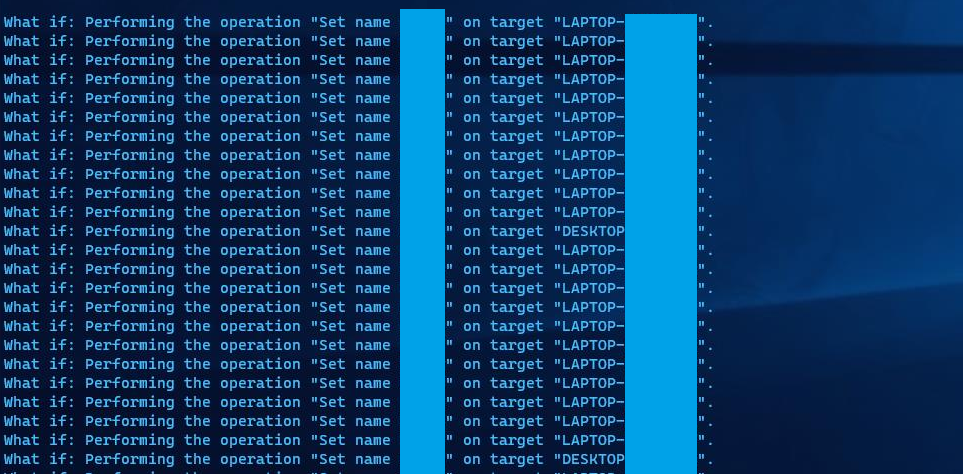
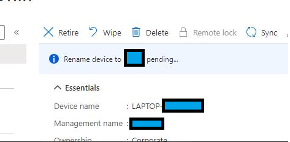

# Fix Azure AD sync when soft (SMTP) and hard match (objectGUID) fail

Even though this shouldn't happen often, I had to write a script for this use case.

The tenantID variable is used because this script runs using Delegated Access Permissions.

I threw this together in about an hour, could use improvements and cleaning up.

### Warning

This operation can have heavy consequences on Azure AD synchronisation. This may change many attributes in ways you don't expect and should proceed with extreme caution before running this script.

[Read this post](https://techcommunity.microsoft.com/t5/azure-active-directory-identity/azure-ad-connect-dealing-with-incorrectly-created-users-post/m-p/220504)

## Use the script
```
Fix-ADSyncMissingImmutableID.ps1 [-UserPrincipalName] <string> [-TenantID] <string> [-ADObjectGUID] <string> [<CommonParameters>]
```
 
## Check if everything went correctly

```Powershell
# Import users in a var named Users containing UPN and ObjectGUID.

Get-MsolUser -TenantId $tenantID | select UserprincipalName, immutableID, @{name="ADbase64ObjectGUID" ;  expression = {[system.Convert]::ToBase64String(( [GUID]($Users | Where userprincipalname -eq $_.Userprincipalname | select -ExpandProperty ObjectGUID)).ToByteArray() ) } } | where ADbase64ObjectGUID -NotLike "AAA*"
```

# Rename-IntuneDevices

Use GRAPH API's endpoint management API to perform device operation (changing owner, rename, and all the standard Intune operations). This script bulk renames devices before they're shipped out to the users from the OEM to be renamed.

At the time of writing this script (summer 2020), Graph API 1.0 does not support request against endpointManagement (returns HTTP 200 but operations are not performed) therefore this script uses beta. 

## Use the script
```Powershell
Rename-IntuneDevices [[-Credentials] <pscredential>] [[-CSVPath] <string>] [[-CustomerTenant] <string>] [-WhatIf] [-Confirm] [<CommonParameters>]
```
WhatIf is supported and shows this:


## Check if everything went correctly
Run get-* operations to receive the device properties. The device needs to rename (and restart) before changes are live. Endpoint Manager shows pending operations:



# Prepare-CustomerDKIM

All in one tool to enable DKIM on multiple EXO tenants. Nothing fancy